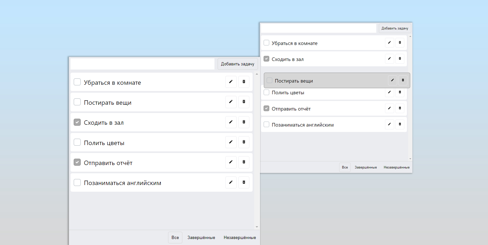

## Redux-toolkit ToDo-list
Простой планировщик задач с функциями редактирования, 
перетаскивания, удаления и сохранением инофрмации в localstorage. Есть возможность фильтрации.


### Используемый стек
* React + TypeScript
* Redux-toolkit и localstorage - для сохранения данных
* Styled-components - для стилизации
* React-beautiful-dnd - для функции перетаскивания элементов

### Установка
Для установки и запуска проекта выполните следующие шаги:

1. Склонируйте репозиторий на локальную машину:

    ```bash
    git clone https://github.com/maestros123/todo.git
    ```

2. Перейдите в директорию проекта:

    ```bash
    cd todo
    ```

3. Установите зависимости:

    ```bash
    npm install
    ```

4. Запустите проект:

    ```bash
    npm start
    ```